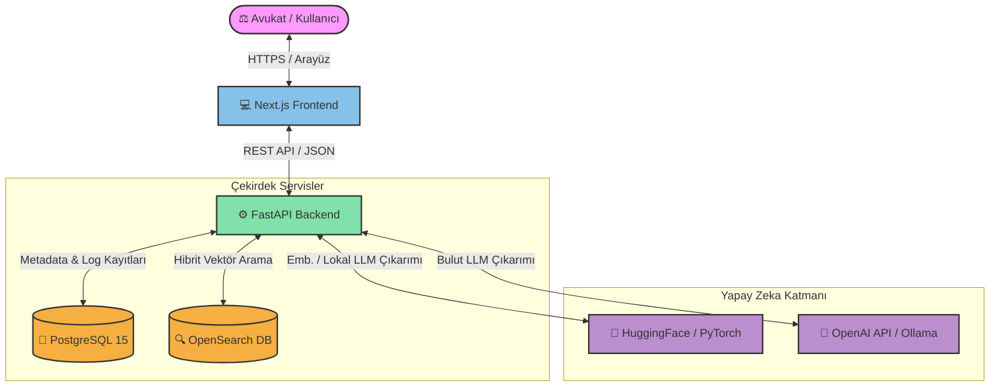

# ⚖️ Legal AI — Orion
> **Advanced Legal Intelligence Workspace** powered by Retrieval-Augmented Generation (RAG), Hybrid Semantic Search, and Local/Cloud LLM orchestration.

---

<p align="center">
  
  
  
  
  
  
  
</p>

---

## 🚀 Projeye Genel Bakış

**Orion (Legal AI)**, hukuk büroları ve avukatlar için özel olarak tasarlanmış, yapay zeka destekli akıllı bir yasal asistan platformudur. Belgelerinizi tarar, indeksler ve **Hibrit Arama (Dense Vector + Lexical Search)** teknolojisini kullanarak yasal belgeleriniz içinden en doğru bilgileri saniyeler içinde çıkararak RAG (Retrieval-Augmented Generation) akışı ile sorularınızı yanıtlar.

---

## ✨ Öne Çıkan Özellikler

* 🔍 **Hibrit Semantic Search (RAG):** `intfloat/multilingual-e5-large` (1024 boyutlu) vektör gömme modeli ve **OpenSearch** entegrasyonu sayesinde belgeleriniz arasında gelişmiş semantik arama.
* 🧠 **Çift Katmanlı LLM Orkestrasyonu:** İster bulut servisleri (**OpenAI GPT-4o/3.5**), ister yerel kaynakları (**Ollama / HuggingFace Transformers - TinyLlama**) kullanarak %100 gizlilik odaklı lokal çıkarım.
* 🛡️ **Gelişmiş Rol Tabanlı Yetkilendirme (RBAC):** Next.js 16 standartlarında güçlendirilmiş Admin ve User yetki yönetimi (`RoleGuard HOC` & API güvenliği).
* ⚡ **NVIDIA CUDA Hızlandırması:** GPU desteği ile lokal yapay zeka modellerini milisaniyeler seviyesinde çalıştırabilme seçeneği.
* 📈 **Gerçek Zamanlı Analitik Paneli:** Kullanıcı sorgularını, token tüketimlerini, RAG doğruluk oranlarını izleme ve raporlama paneli.

---

## 🏗️ Sistem Mimarisi & Veri Akışı

Platform, mikroservis odaklı bir mimari üzerinde dockerize edilerek kurulmuştur. Aşağıdaki şema, kullanıcının sorgusunun sisteme girmesinden itibaren dönen RAG akışını temsil etmektedir:



---

## 🛠️ Teknoloji Yığını (Tech Stack)

| Katman                   | Teknoloji                                   | Açıklama                                               |
| :----------------------- | :------------------------------------------ | :----------------------------------------------------- |
| **Arayüz (Frontend)**    | Next.js 15/16 (App Router), TS, TailwindCSS | Hızlı, SEO dostu ve responsive modern panel.           |
| **Sunucu (Backend)**     | FastAPI (Python 3.10+), SQLAlchemy          | Asenkron, yüksek performanslı RESTful API.             |
| **İlişkisel Veritabanı** | PostgreSQL 15                               | Kullanıcı rolleri, doküman meta verileri ve log kaydı. |
| **Vektör Veritabanı**    | OpenSearch 2.12.0                           | Büyük ölçekli metin indeksleme ve vektör arama.        |
| **Yapay Zeka / ML**      | PyTorch, Transformers, OpenAI               | `multilingual-e5-large` ve local `TinyLlama` motoru.   |
| **Konteynerizasyon**     | Docker, Docker Compose                      | Bağımsız, taşınabilir ve hızlı dağıtım mimarisi.       |

---

## 🚀 Hızlı Başlangıç (Getting Started)

Proje hem yerel geliştirme ortamında (Local Dev) hem de konteynerler (Docker) üzerinde çalışacak şekilde optimize edilmiştir.

### 📋 Ön Gereksinimler
* Docker & Docker Compose kurulu olmalı.
* *(GPU Modu İçin)* NVIDIA Ekran Kartı & [NVIDIA Container Toolkit](https://docs.nvidia.com/datacenter/cloud-native/container-toolkit/latest/install-guide.html) kurulu olmalı.

---

### 🐳 Seçenek A: Docker ile Tek Tıkla Ayağa Kaldırma (Önerilen)

Öncelikle yapılandırma şablonunu kopyalayın:
```bash
cp .env.example .env
```
Ardından sisteminize göre aşağıdaki başlatma modlarından birini seçin:

#### 1. CPU (GPU'suz) Modu
Eğer bilgisayarınızda NVIDIA ekran kartı yoksa:
1. `.env` dosyası içinde `LLM_DEVICE=cpu` olarak güncelleyin.
2. Aşağıdaki komutla başlatın:
   ```bash
   make docker-up
   # Veya manuel: docker compose up --build -d
   ```

#### 2. GPU (NVIDIA CUDA) Modu
Eğer CUDA destekli bir NVIDIA ekran kartınız varsa (lokal modeller çok daha hızlı çalışır):
1. `.env` dosyası içinde `LLM_DEVICE=cuda` olarak güncelleyin.
2. Aşağıdaki komutla başlatın:
   ```bash
   make docker-up-gpu
   # Veya manuel: docker compose -f docker-compose.yml -f docker-compose.gpu.yml up --build -d
   ```

#### 🛑 Servisleri Durdurmak İçin:
```bash
make docker-down
# Veya manuel: docker compose down
```

---

### 💻 Seçenek B: Yerel Geliştirme (Local Development)

Projeyi kendi bilgisayarınızda servis servis kurarak çalıştırmak isterseniz:

1. **Bağımlılıkları Kurun:**
   ```bash
   make setup
   ```
2. **Altyapıyı Başlatın (PostgreSQL ve OpenSearch):**
   ```bash
   # Sadece OpenSearch'ü docker üzerinden başlatmak için:
   make start-opensearch
   ```
3. **Backend Sunucusunu Başlatın:**
   ```bash
   make run-backend
   ```
4. **Frontend Sunucusunu Başlatın:**
   ```bash
   make run-frontend
   ```

---

## 📂 Proje Dizin Yapısı

```directory
legal-ai/
├── backend/                  # FastAPI Sunucusu & RAG Boru Hattı
│   ├── app/
│   │   ├── api/              # API Route Katmanları (Auth, Docs, Search)
│   │   ├── core/             # Konfigürasyon, Güvenlik, Veritabanı Bağlantısı
│   │   ├── models/           # SQLAlchemy DB Tablo Şemaları
│   │   ├── services/         # LLM, Embedding, OpenSearch Arama Servisleri
│   │   └── main.py           # Sunucu Giriş Noktası
│   ├── Dockerfile
│   └── requirements.txt
├── frontend-next/            # Next.js Web Arayüzü
│   ├── src/
│   │   ├── app/              # Dashboard, Analitik, Ayarlar Sayfaları (Next App Router)
│   │   ├── components/       # reusable UI Bileşenleri & Yetki Koruması (RoleGuard)
│   │   └── proxy.ts          # API Proxy Geçidi
│   ├── Dockerfile
│   └── package.json
├── sql/                      # Veritabanı Başlangıç Şemaları & Seed Verileri
├── docker-compose.yml        # Temel Docker Compose Yapılandırması
├── docker-compose.gpu.yml    # GPU (CUDA) Override Dosyası
├── Makefile                  # Sık kullanılan terminal komutları kısayolları
├── .env.example              # Ortam Değişkenleri Şablonu
└── README.md                 # Proje Dokümantasyonu
```

---

## 🔌 API Dokümantasyonu

Konteynerler ayağa kalktıktan sonra aşağıdaki servis portları üzerinden sistemi izleyebilirsiniz:

* **Sistem Arayüzü (Frontend Next.js):** [http://localhost:3000](http://localhost:3000)
* **API Swagger Dokümantasyonu (FastAPI Docs):** [http://localhost:8000/docs](http://localhost:8000/docs)
* **OpenSearch Arayüzü (Dashboards):** [http://localhost:5601](http://localhost:5601) *(monitoring profili aktifse)*

---

## 🛡️ Güvenlik ve Uyarılar
* Üretim (Production) ortamına geçmeden önce `.env` dosyasındaki `SECRET_KEY`, `POSTGRES_PASSWORD` ve `OPENSEARCH_ADMIN_PASSWORD` değerlerini mutlaka **güçlü ve benzersiz** şifrelerle değiştirin.
* `.env` dosyası hassas veriler içerdiğinden asla git havuzuna (repository) commit edilmemelidir.

---
<p align="center">
  Made with ❤️ by the Legal AI Developer Team.
</p>
