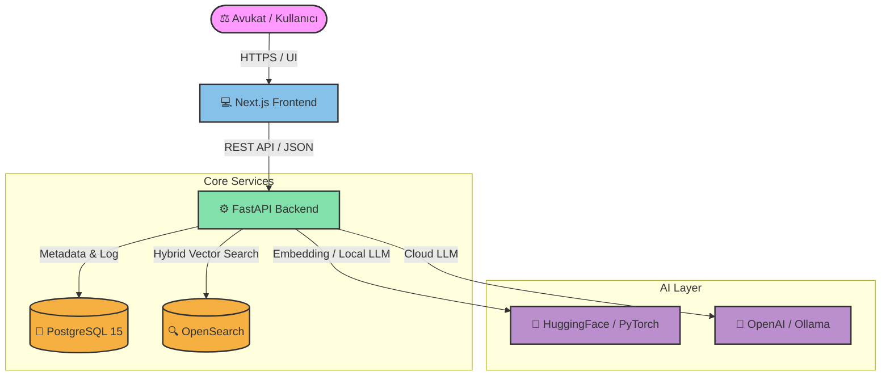

# ⚖️ Legal AI

> **Advanced Legal Intelligence Workspace** powered by Retrieval‑Augmented Generation (RAG), Hybrid Semantic Search, and Local/Cloud LLM orchestration.

---

<p align="center">
  
  
  
  
  
  
  
  
</p>

---

## 📖 Proje Hakkında

**Legal AI**, hukuk büroları ve avukatlar için özel olarak tasarlanmış, yapay zeka destekli bir yasal asistan platformudur. Belgelerinizi otomatik olarak tarar, indeksler ve **Hibrit Arama (Dense Vector + Lexical Search)** sayesinde en doğru bilgileri saniyeler içinde çıkararak RAG (Retrieval‑Augmented Generation) akışı ile sorularınızı yanıtlar.

---

## ✨ Öne Çıkan Özellikler

| Özellik                             | Açıklama                                                                  |
| ----------------------------------- | ------------------------------------------------------------------------- |
| 🔍 **Hibrit Semantic Search (RAG)** | `intfloat/multilingual-e5-large` vektör modeli + OpenSearch entegrasyonu  |
| 🤖 **LLM Orkestrasyonu**            | Bulut (OpenAI) ve yerel (Ollama) modeller arasında geçiş                  |
| 🛡️ **Gelişmiş RBAC**                | Admin / User rolleri için RoleGuard HOC ve API korumaları                 |
| ⚡ **CUDA Hızlandırması**           | GPU destekli local modeller için milisaniye seviyesinde yanıt             |
| 📈 **Gerçek Zamanlı Analitik**      | Sorgu istatistikleri, token tüketimi ve doğruluk oranları paneli          |
| 📂 **Belge Yönetimi**               | PDF, DOCX yükleme; otomatik chunking ve vektör indeksleme                 |
| 🔐 **JWT Kimlik Doğrulama**         | Güvenli oturum yönetimi; refresh token desteği                            |

---

## 🏗️ Sistem Mimarisi & Veri Akışı



---

## 🛠️ Teknoloji Yığını

| Katman        | Teknoloji                                              | Açıklama                                          |
| ------------- | ------------------------------------------------------ | ------------------------------------------------- |
| **Frontend**  | Next.js 15/16 (App Router) • TypeScript • TailwindCSS  | SEO‑dostu, responsive modern panel                |
| **Backend**   | FastAPI (Python 3.10+) • SQLAlchemy • Alembic          | Asenkron, yüksek performanslı REST API            |
| **RDBMS**     | PostgreSQL 15                                          | Kullanıcı rolleri, doküman meta ve log kayıtları  |
| **Vektör DB** | OpenSearch 2.12                                        | Büyük ölçekli metin indeksleme & vektör arama     |
| **AI / ML**   | PyTorch • Transformers • OpenAI / Ollama               | `multilingual-e5-large` ve büyük dil modelleri    |
| **Container** | Docker • Docker‑Compose                                | Taşınabilir, hızlı dağıtım                        |

---

## 🚀 Hızlı Başlangıç

### 📋 Ön Gereksinimler

- **Docker** & **Docker‑Compose** v2+ (GPU desteği için NVIDIA Container Toolkit)
- **Python 3.10+** (lokal geliştirme için)
- **Node.js 20+** (frontend geliştirme için)
- **OpenAI API Key** (bulut LLM kullanımı için)

### ⚙️ Docker ile Tek Tıkla Çalıştırma (Önerilen)

```bash
# 1. .env şablonunu kopyala ve düzenle
cp .env.example .env
nano .env   # en az OPENAI_API_KEY ve SECRET_KEY'i gir

# 2a. CPU Modu
docker compose up --build -d
# ya da Makefile ile: make docker-up

# 2b. GPU Modu (NVIDIA CUDA gerekli)
docker compose -f docker-compose.yml -f docker-compose.gpu.yml up --build -d
# ya da Makefile ile: make docker-up-gpu
```

Durdurmak için:
```bash
docker compose down          # servisleri durdur
docker compose down -v       # servisleri + volume'ları temizle
# ya da: make docker-down
```

### 🖥️ Yerel Geliştirme (Local Dev)

```bash
# 1. Bağımlılıkları kur (backend venv + frontend node_modules)
make setup

# 2. Altyapı servislerini başlat (OpenSearch, PostgreSQL)
docker compose up db opensearch -d

# 3. Backend'i çalıştır
make run-backend   # http://localhost:8000

# 4. Frontend'i çalıştır (ayrı terminalde)
make run-frontend  # http://localhost:3000
```

---

## 🔑 Ortam Değişkenleri

`.env.example` dosyasını kopyalayarak `.env` oluşturun. Kritik değişkenler:

| Değişken                    | Açıklama                                              | Örnek / Varsayılan                        |
| --------------------------- | ----------------------------------------------------- | ----------------------------------------- |
| `SECRET_KEY`                | JWT imzalama anahtarı — **mutlaka değiştirin**        | `openssl rand -hex 32` çıktısı            |
| `OPENAI_API_KEY`            | OpenAI API erişim anahtarı                            | `sk-...`                                  |
| `LLM_DEVICE`                | Model çalıştırma cihazı                               | `cpu` veya `cuda`                         |
| `POSTGRES_USER`             | PostgreSQL kullanıcı adı                              | `legalai`                                 |
| `POSTGRES_PASSWORD`         | PostgreSQL şifresi — **mutlaka değiştirin**           | `supersecret`                             |
| `POSTGRES_DB`               | Veritabanı adı                                        | `legalai_db`                              |
| `OPENSEARCH_ADMIN_PASSWORD` | OpenSearch admin şifresi — **mutlaka değiştirin**     | `Admin@1234`                              |
| `OPENSEARCH_INDEX`          | Belge vektörlerinin saklandığı indeks adı             | `legal_docs`                              |
| `EMBEDDING_MODEL`           | Kullanılacak HuggingFace embedding modeli             | `intfloat/multilingual-e5-large`          |
| `OPENAI_MODEL`              | Kullanılacak OpenAI modeli                            | `gpt-4o`                                  |
| `CORS_ORIGINS`              | İzin verilen frontend origin'leri (virgülle ayrılmış) | `http://localhost:3000`                   |

> **Not:** Tüm değişkenlerin tam listesi için `.env.example` dosyasına bakın.

---

## 📂 Proje Dizin Yapısı

```
legal-ai/
├─ backend/                 # FastAPI sunucu & RAG pipeline
│   ├─ app/
│   │   ├─ api/            # Route katmanları (auth, docs, search, admin)
│   │   ├─ core/           # Konfigürasyon, güvenlik, DB bağlantısı
│   │   ├─ models/         # SQLAlchemy şema tanımları
│   │   ├─ services/       # LLM, embedding, OpenSearch servisleri
│   │   ├─ vectorstore/    # OpenSearch istemcisi & indeks yönetimi
│   │   └─ main.py         # Uygulama giriş noktası
│   ├─ Dockerfile
│   └─ requirements.txt
├─ frontend-next/           # Next.js 15 (App Router) UI
│   ├─ src/
│   │   ├─ app/            # Dashboard, Analytics, Cases, Settings
│   │   ├─ components/     # Yeniden kullanılabilir UI & RoleGuard HOC
│   │   ├─ lib/            # API istemcisi & yardımcı fonksiyonlar
│   │   └─ types/          # TypeScript tip tanımları
│   ├─ Dockerfile
│   └─ package.json
├─ sql/                     # DB şema (DDL) & seed verileri
├─ infra/                   # Altyapı konfigürasyonları (OpenSearch, Nginx)
├─ scripts/                 # Yardımcı otomasyon scriptleri
├─ data/                    # Örnek hukuki dokümanlar (test verisi)
├─ docker-compose.yml       # Temel servis tanımları
├─ docker-compose.gpu.yml   # GPU override konfigürasyonu
├─ Makefile                 # Kısayol komutları
├─ .env.example             # Ortam değişkenleri şablonu
├─ LICENSE                  # MIT Lisansı
└─ README.md                # 📄 Bu dokümantasyon
```

---

## 📚 API Dokümantasyonu

Konteynerler ayağa kalktıktan sonra:

| Servis               | URL                                      |
| -------------------- | ---------------------------------------- |
| **Frontend UI**      | <http://localhost:3000>                  |
| **FastAPI Swagger**  | <http://localhost:8000/docs>             |
| **FastAPI ReDoc**    | <http://localhost:8000/redoc>            |
| **OpenSearch Dash.** | <http://localhost:5601> *(opsiyonel)*    |

Temel endpoint'ler:

```
POST   /api/auth/login          # Kullanıcı girişi → JWT token
POST   /api/auth/register       # Yeni kullanıcı kaydı
GET    /api/documents           # Yüklü belgeleri listele
POST   /api/documents/upload    # Belge yükle & indeksle
POST   /api/search/query        # RAG tabanlı soru-cevap
GET    /api/analytics/stats     # Token & sorgu istatistikleri
GET    /api/admin/users         # Kullanıcı yönetimi (admin)
```

---

## 🛡️ Güvenlik ve Üretim Önerileri

- `.env` içindeki `SECRET_KEY`, `POSTGRES_PASSWORD` ve `OPENSEARCH_ADMIN_PASSWORD` değerlerini **güçlü, benzersiz** şifrelerle değiştirin.
- `.env` dosyası **kesinlikle Git reposuna commit edilmemelidir**. `.gitignore` dosyasında `.env` satırının bulunduğunu doğrulayın.
- Production ortamında HTTPS terminali (Nginx / Traefik), **rate limiting** ve **audit logging** yapılandırmalarını etkinleştirin.
- `docker-compose.yml`'deki `--reload` flag'ini production'da kaldırın.
- Düzenli olarak `docker compose pull` komutu ile baz imajları güncelleyin.

---

## 🤝 Katkıda Bulunma

Katkılarınız memnuniyetle karşılanır! Lütfen aşağıdaki adımları izleyin:

1. Bu repoyu **fork** edin.
2. Feature branch'i oluşturun:
   ```bash
   git checkout -b feature/harika-ozellik
   ```
3. Değişikliklerinizi commit edin:
   ```bash
   git commit -m "feat: harika özellik eklendi"
   ```
4. Branch'inizi push edin:
   ```bash
   git push origin feature/harika-ozellik
   ```
5. **Pull Request** açın ve açıklamalı bir başlık ekleyin.

### Kod Standartları

- **Backend**: PEP 8 uyumlu Python; tür anotasyonları zorunlu.
- **Frontend**: ESLint + Prettier konfigürasyonlarına uyun.
- Her yeni özellik için ilgili belgeleri güncelleyin.

---

## ❓ Sık Sorulan Sorular (FAQ)

<details>
<summary><strong>GPU olmadan çalıştırabilir miyim?</strong></summary>

Evet. `.env` dosyasında `LLM_DEVICE=cpu` ayarlayın ve `docker compose up --build -d` komutunu kullanın. CPU modunda embedding ve LLM yanıtları daha yavaş olacaktır.

</details>

<details>
<summary><strong>Hangi dosya formatları destekleniyor?</strong></summary>

Şu an **PDF** ve **DOCX** formatları desteklenmektedir. Diğer formatlar için `backend/app/services/document_parser.py` dosyasını genişletebilirsiniz.

</details>

<details>
<summary><strong>OpenAI yerine yerel bir model kullanabilir miyim?</strong></summary>

Evet. [Ollama](https://ollama.com/) kurarak `.env` dosyasında `OLLAMA_BASE_URL` ve `OLLAMA_MODEL` değişkenlerini yapılandırın, ardından `LLM_PROVIDER=ollama` olarak ayarlayın.

</details>


---

## 📄 Lisans

Bu proje **MIT Lisansı** altında lisanslanmıştır. Detaylar için [LICENSE](./LICENSE) dosyasına bakın.

---

## 🙏 Teşekkürler

Bu projeyi hayata geçiren **Legal AI Developer Team**'e ❤️.

---

<p align="center">
  Made with ❤️ by the Legal AI Developer Team.
</p>
